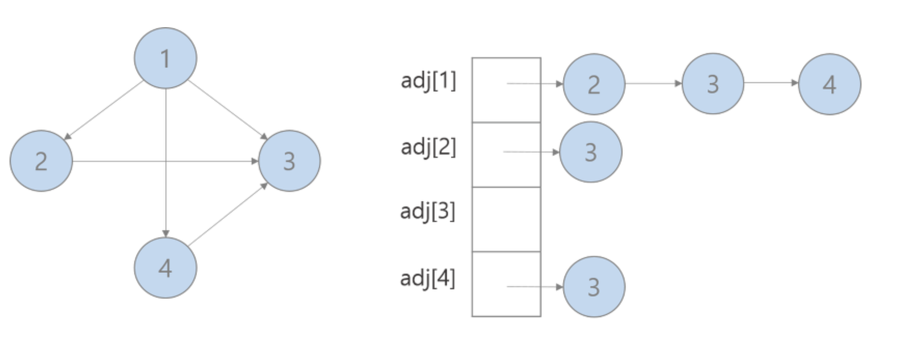
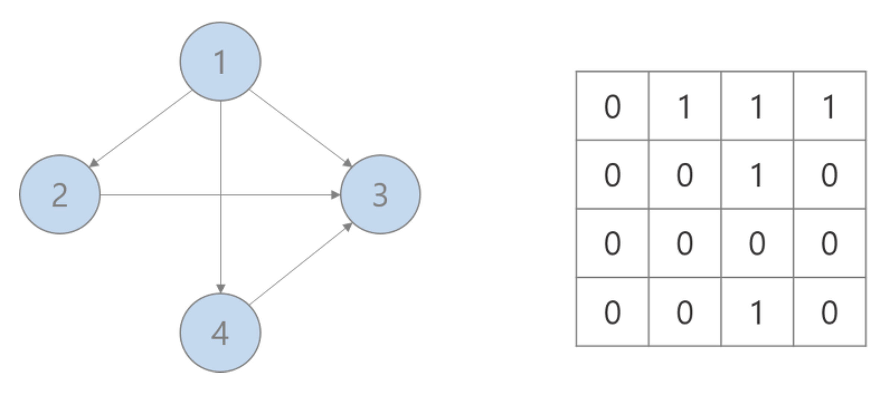

# 트리와 그래프

### 트리의 종류

트리는 노드로 이루어진 자룍조로, 사이클이 존재할 수 없음

##### ☑️ 이진트리

노드가 최대 두 개의 자식을 갖는 트리

##### ☑️ 이진 탐색 트리

모든 노드가 '왼쪽 자식들 <=n<모든 오른쪽 자식들' 을 만족시키는 이진트리

##### ☑️ 균형 vs 비균형

왼쪽과 오른쪽 부분 트리의 크기가 완전히 같아야만 균형 트리인 것은 아님

##### ☑️ 완전 이진 트리

트리의 모든 높이에서 노드가 꽉 차 있는 이진 트리. 마지막 level은 꽉 차 있지 않아도 되지만 노드가 왼쪽에서 오른쪽으로 채워져야 함

##### ☑️ 전 이진 트리

모든 노드의 자식이 없거나 정확히 두 개 있는 경우 -> 자식이 하나만 있는 노드가 존재 X

##### ☑️ 포화 이진 트리

- 전 이진 트리이면서 완전 이진 트리인 경우
- 모든 말단 노드는 같은 높이에 있어야 함

### 이진 트리 순회

##### ☑️ 중위 순회

왼쪽 가지 -> 현재 노드 -> 오른쪽 가지 순서로 노드를 방문

##### ☑️전위 순회

자식 노드보다 현재 노드를 먼저 방문하는 방법

##### ☑️후위 순회

모든 자식 노드들을 먼저 방문한 뒤 마지막에 현재 노드를 방문하는 방법

### 이진 힙

- 완전 이진 트리
- 각 노드의 원소가 자식들의 원소보다 작음

- 연산 (최소 힙)

  1. 삽입

     완전 트리 속성에 위배되지 않게 가장 밑바닥 오른쪽 위치에 삽입되고 제대로 된 자리를 찾을 때까지 부모 노드와 교환

  2. 최소 원소 뽑아내기

     최소 원소는 언제나 가장 위에 놓임. 최소 원소 제거 후 힙에 있는 가장 마지막 노드를 가장 위로 올린 후 최소힙의 성질을 만족하도록 해당 노드를 자식 노드와 교환해 나간다.

### 트라이 (접두사 트리)

- 각 노드에 문자를 저장하는 자료구조
- null노드를 사용해 단어의 끝을 나타냄
- 접두사를 빠르게 찾아보기 위한 흔한 방식
- 길이가 K인 문자열이 주어졌을 때 O(K) 시간에 해당 문자열이 유효한 접두사인지 확인 가능

### 그래프

- 트리는 사이클이 없는 하나의 연결 그래프임
- 그래프는 단순히 노드와 그 노드를 연결하는 간선을 하나로 모아 놓은 것과 같음
- 연결 그래프 : 모든 정점 쌍 간에 경로가 존재하는 그래프
- 비순환 그래프 : 사이클이 없는 그래프

- 구현

  1. 인접 리스트
     

  2. 인접 행렬
     

##### ☑️ 그래프 탐색

1. 깊이 우선 탐색
   루트에서 시작해 다음 분기로 넘어가기 전에 해당 분기를 완벽하게 탐색하는 방법

2. 너비 우선 탐색
   루트 노드에서 시작해 인접한 노드를 먼저 탐색하는 방법

##### ☑️ 양방향 탐색

- 출발지와 도착지 사이에 최단 경로를 찾을 때 사용됨
- 출발지와 도착지 두 노드에서 동시에 너비 우선 탐색을 수행한 뒤, 두 탐색 지점이 충돌하는 경우에 경로를 찾는 방식
- 너비우선탐색보다 빠르게 최단 경로를 찾을 수 있음
